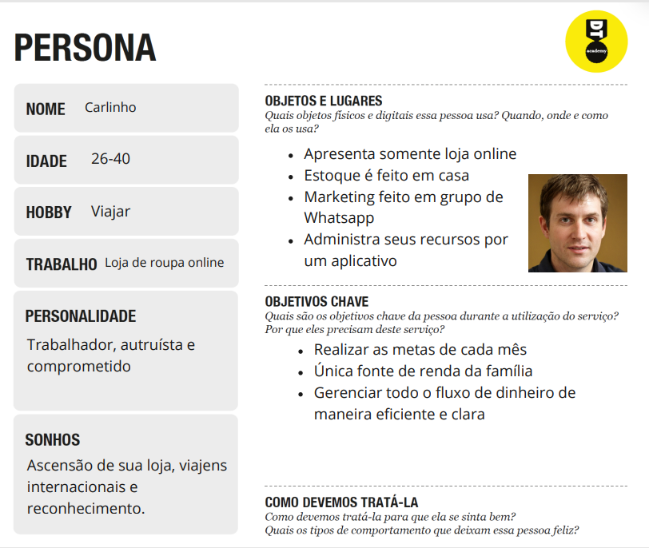
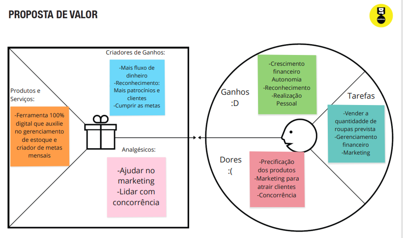
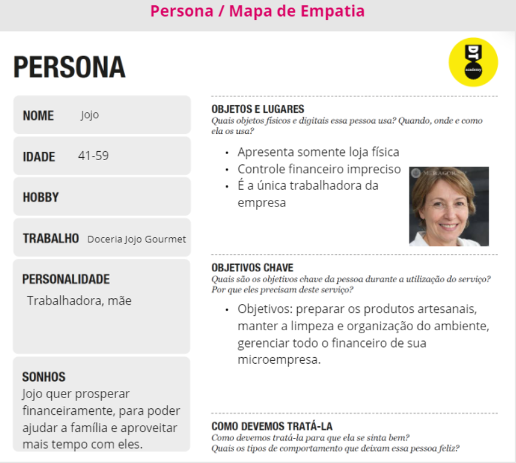
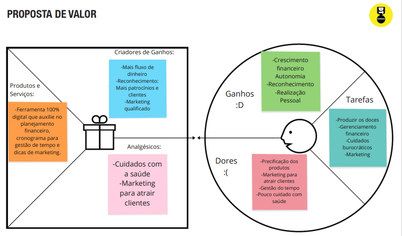
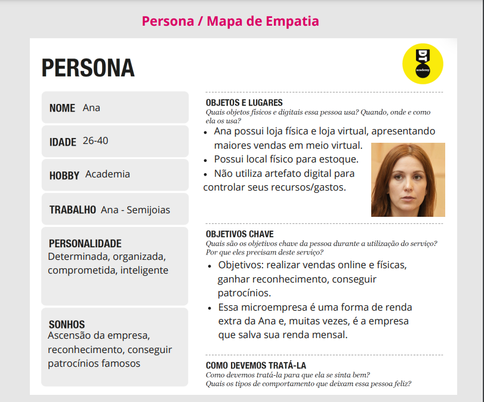
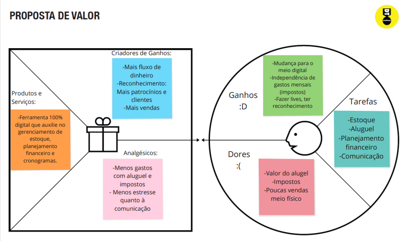

# Informações do Projeto
`TÍTULO DO PROJETO`  

### CloudCap
##### Suas finanças decolam rumo ao futuro

`CURSO` 

 - Engenharia de Software

## Participantes
 - Pedro Henrique Braga de Castro  
 - Talisson Augusto Prudêncio Santos  
 - Sabrina Ferreira Vieira  
 - Christian Nathan Lima Signoretti  
 - João Victor Pinheiro de Vasconcelos  

# Estrutura do Documento

- [Informações do Projeto](#informações-do-projeto)
  - [Participantes](#participantes)
- [Estrutura do Documento](#estrutura-do-documento)
- [Introdução](#introdução)
  - [Problema](#problema)
  - [Objetivos](#objetivos)
  - [Justificativa](#justificativa)
  - [Público-Alvo](#público-alvo)
- [Especificações do Projeto](#especificações-do-projeto)
  - [Personas, Empatia e Proposta de Valor](#personas-empatia-e-proposta-de-valor)
  - [Histórias de Usuários](#histórias-de-usuários)
  - [Requisitos](#requisitos)
    - [Requisitos Funcionais](#requisitos-funcionais)
    - [Requisitos não Funcionais](#requisitos-não-funcionais)
  - [Restrições](#restrições)
- [Projeto de Interface](#projeto-de-interface)
  - [User Flow](#user-flow)
  - [Wireframes](#wireframes)
- [Metodologia](#metodologia)
  - [Divisão de Papéis](#divisão-de-papéis)
  - [Ferramentas](#ferramentas)
  - [Controle de Versão](#controle-de-versão)

# Introdução

## Problema

Atualmente, os microempreendedores sofrem com a inconstância do mercado financeiro, pois o fluxo de clientes varia muito durante o ano e as taxas de impostos tornam-se cada vez mais crescentes. Em consonância, existe uma alta competitividade no mercado, o que exige marketing adequado e a cima de tudo, um excelente controle financeiro. Diante desse cenário, torna-se importante controlar o fluxo de caixa e o estoque para que o microempreendedor consiga alcançar suas metas mensais e manter o seu negócio. 

## Objetivos

O principal objetivo é nortear as decisões da empresa para viabilizar o fortalecimento da organização e proporcionar um crescimento efetivo.Portanto, nossa aplicação tem por objetivo auxiliar o microemprendedor a administrar as finanças de sua loja, não só ajudando a controlar o fluxo de caixa e o estoque, mas também a criar metas mensais e montar cronogramas de organização.

## Justificativa

É importante controlar o fluxo de caixa e o estoque porque diversas microempresas já fecharam no Brasil, devido a falta de clientes e o excesso de estoques. Também, diversos negócios sofrem com a variação dos impostos, sendo necessário fazer análises do que comprar e de quanto comprar. Por isso, é de suma importância proporcionar ajuda a esse grupo, fazendo com que tenham maior controle sobre esses aspectos, afim de que seja possível fortalecer seu negócio. 

## Público-Alvo

1) Microempreendedor de loja física: dono de uma loja física, que apresenta um imóvel alugado, paga altas taxas de impostos, mantém o estoque junto da loja física e possui funcionários.
2) Microempreendedor de loja virtual: apresenta somente instagram ou whatsapp como divulgação da loja, o estoque é em sua própria casa e não possui funcionários.
3) Microempreendedor de loja física e virtual: apresenta divulgação em loja virtual e uma loja física, imóvel alugado que serve de estoque e loja física, possui funcionários, faz lives no instagram para divulgação e marketing de seu negócio.  

 
# Especificações do Projeto

Essa parte será a identificação correta do problema. Com isso nós utilizamos a Matriz de Alinhamento CSD para criar perguntas e conseguimos realizar entrevistas qualitativas, montar nossas personas e entender melhor qual era o obstáculo de cada uma, como isso afetava suas vidas e como poderíamos ajudar. Com a criação das Propostas de Valor  realmente entendemos as dores que o impedimento causava na persona e criamos as Histórias de Usuário. Com isso, foi possível identificar os Requisítos necessários para criarmos nosso Wireframe e cumprir nossa meta. 
A ferramenta utilizada para essa etapa foi o Miro.

## Personas, Empatia e Proposta de Valor

### Primeira Persona

Carlinho possui uma loja de camisetas de times de futebol, com vendas somente online.

Os maiores problemas de Carlinho são: Dificuldade em atrair clientes e Concorrência do meio fisico e online.

### Segunda Persona

Jojo possui uma doceria localizada no centro de sua cidade.

Os maiores problemas de Jojo são: Má gestão de tempo pessoal e Precificação dos produtos.

### Terceira Persona

Ana possui loja física e virtual que vende semijoias.

Os maiores problemas de Ana são: Alto valor de impostas e Poucas vendas em meio físico.

## Histórias de Usuários

Com base na análise das personas foram identificadas as seguintes histórias de usuários:

|      EU COMO       |            QUERO/PRECISO           |                 PARA                   |
|--------------------|------------------------------------|----------------------------------------|
|Usuário do sistema  | Registrar minhas metas mensais     |Focar nos meus objetivos                |
|Administrador       | Controlar o fluxo de caixa         |Controlar os gastos e ganhos            |
|Gerenciador         | Organizar meu estoque              |Realizar reposições corretamente        |
|Usuário do sistema  | Receber alertas e mensagens        |Manter atualizado sobre o negócio       |
|Aprendiz            | Educação Financeira                |Realizar futuros investimentos          |

## Requisitos

As tabelas que se seguem apresentam os requisitos funcionais e não funcionais que detalham o escopo do projeto.

### Requisitos Funcionais

|ID    | Descrição do Requisito  | Prioridade |
|------|-----------------------------------------|----|
|RF-001| Permitir que o usuário cadastre metas mensais | ALTA | 
|RF-002| Realizar atualizações de estoque  | ALTA |
|RF-003| Emitir alertas e mensagens | ALTA |
|RF-004| Informações sobre educação financeira | MÉDIA |
|RF-006| Acesso a podcasts e entrevistas | MÉDIA |
|RF-007| Realizar orçamento e planejamento financeiro | ALTA |

### Requisitos não Funcionais

|ID     | Descrição do Requisito  |Prioridade |
|-------|-------------------------|----|
|RNF-001| O sistema deve ser responsivo para rodar em um dispositivos móvel | MÉDIA | 
|RNF-002| Deve processar requisições do usuário em no máximo 3s |  BAIXA | 
|RNF-003| Sistema muito complexo e difícil de manusear | ALTA |

## Restrições

O projeto está restrito pelos itens apresentados na tabela a seguir.

|ID| Restrição                                             |
|--|-------------------------------------------------------|
|01| O projeto deverá ser entregue até o final do semestre |
|02| Não pode ser desenvolvido um módulo de backend        |
|03| Não pode ser um site complexo de utilizar             |

# Projeto de Interface

- Tela inicial:
Usuário realizar login em sua conta. Permitindo que todos os dados estejam seguros e armazenados a um perfil.

- Controle de Estoque: 
Criar um gráfico do tipo "pizza" para que o usuário consiga atualizar constantemente os dados; ser ilustrativo, mostrando a quantidade, porcentagens, ícones e valores de cada produto pertencente à loja. 

- Orçamento e Planejamento Financeiro: 
Controle do fluxo de caixa através de tabelas associadas a planejamentos e metas mensais.

- Acesso a Podcasts: 
Informação sobre educação financeira; atualizações do mercado financeiro ; precificação dos produtos.

- Alertas e Mensagens: 
Em conjunto das outras funcionalidades, emitir alertas ao usuário sempre quando uma alteração for feita no site; enviar mensagens de alerta sobre novos podcasts, mercadorias em falta, etc.

## User Flow

......  INCLUA AQUI O DIAGRAMA COM O FLUXO DO USUÁRIO NA APLICAÇÃO ......

> Fluxo de usuário (User Flow) é uma técnica que permite ao desenvolvedor
> mapear todo fluxo de telas do site ou app. Essa técnica funciona
> para alinhar os caminhos e as possíveis ações que o usuário pode
> fazer junto com os membros de sua equipe.
>
> **Links Úteis**:
> - [User Flow: O Quê É e Como Fazer?](https://medium.com/7bits/fluxo-de-usu%C3%A1rio-user-flow-o-que-%C3%A9-como-fazer-79d965872534)
> - [User Flow vs Site Maps](http://designr.com.br/sitemap-e-user-flow-quais-as-diferencas-e-quando-usar-cada-um/)
> - [Top 25 User Flow Tools & Templates for Smooth](https://www.mockplus.com/blog/post/user-flow-tools)
>
> **Exemplo**:
> 
> 

## Wireframes

......  INCLUA AQUI OS WIREFRAMES DAS TELAS DA APLICAÇÃO COM UM BREVE DESCRITIVO ......

> Wireframes são protótipos das telas da aplicação usados em design de interface para sugerir a
> estrutura de um site web e seu relacionamentos entre suas
> páginas. Um wireframe web é uma ilustração semelhante ao
> layout de elementos fundamentais na interface.
> 
> **Links Úteis**:
> - [Ferramentas de Wireframes](https://rockcontent.com/blog/wireframes/)
> - [Figma](https://www.figma.com/)
> - [Adobe XD](https://www.adobe.com/br/products/xd.html#scroll)
> - [MarvelApp](https://marvelapp.com/developers/documentation/tutorials/)
> 
> **Exemplo**:
> 
> 

# Metodologia

Nossa equipe foi divida baseada nos 4 tipos de perfis comportamentais. Em conjunto, a metodologia utilizada pelo grupo foi o Scrum, diante isso realizamos reuniões diárias para saber como estava o andamento do projeto. Todos do grupo participaram ativamente do processo de Design Thinking, desde a Matriz de Alinhamento CSD até a criação das personas. Também, fizemos o Brainstorming afim de propormos soluções para nosso problema. Depois que as soluções foram propostas, analizamos cada História de Usuário e unimos as ideias em um só projeto, afim de que todos os Requisistos Funcionais e Não Funcionais fossem atentidos. Com isso, chegamos a parte final e criamos um wireframe que iremos trabalhar nas futuras atividades do curso.
Nosso grupo utilizou a plataforma Miro para realizar todas as etapas do Design Thinking. Já, a parte documentacional foi feita totalmente no GitHub. O material de  apresentação foi feito através do PowerPoint.

## Divisão de Papéis

Todos os integrantes participaram de todas as etapas, porém, alguns se destacaram em algumas partes devido as suas habilidades e dedicação com o curso:
 - Pedro Henrique : Criação de Wireframe, Relatório Técnico e Apresentação do trabalho.
 - Talisson : Criação de Wireframe, Design do Projeto e Apresentação do trabalho.
 - Sabrina : Criação de Wireframe, Responsável pelo Processo de Design Thinking.
 - Christian: Entrevista Qualitativa.
 - João : Mapa de Alinhamento CSD.

## Ferramentas

| Ambiente  | Plataforma              |Link de Acesso |
|-----------|-------------------------|---------------|
|Processo de Design Thinkgin  | Miro |  https://miro.com/app/board/uXjVMYDaOFw=/ | 
|Repositório de código | GitHub | https://github.com/ICEI-PUC-Minas-PPLES-TI/plf-es-2023-1-ti1-0385100-problemas-de-gestao-financeira-3 | 
|Protótipo Interativo | Miro | https://miro.com/app/board/uXjVMYDaOFw=/ | 

## Controle de Versão

 O projeto segue a seguinte convenção para o nome de branchs:

 - `master`: versão estável já testada do software
 - `unstable`: versão já testada do software, porém instável
 - `testing`: versão em testes do software
 - `dev`: versão de desenvolvimento do software

Quanto à gerência de issues, o projeto adota a seguinte convenção para
etiquetas:

 - `bugfix`: uma funcionalidade encontra-se com problemas
 - `enhancement`: uma funcionalidade precisa ser melhorada
 - `feature`: uma nova funcionalidade precisa ser introduzida

